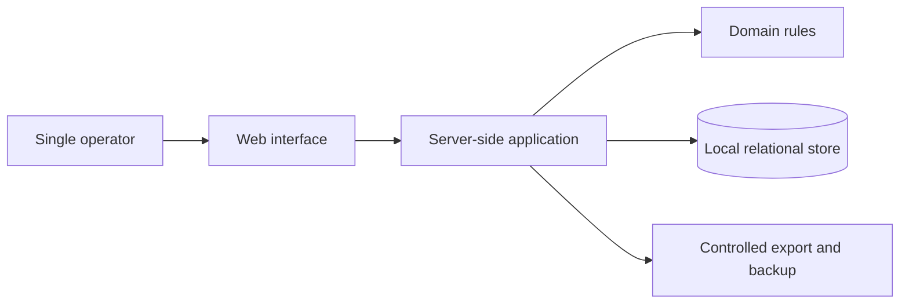

# Company Intelligence Engine

A local-first application for organising company-building work, decisions, and
operational knowledge.

| | |
| --- | --- |
| Status | Partially implemented |
| Implementation | Multiple completed and verified releases; the current release programme still includes operational and review work |
| Repository | Not linked from this public portfolio |

## Overview

Company Intelligence Engine (CIE) brings planning, project state, decisions,
relationships, and internal knowledge into one coherent application. It is
designed for a single operator and favours explicit structure over a collection
of disconnected spreadsheets and notes.

The public case study focuses on application architecture and delivery
discipline. Private records, operating procedures, and detailed security
configuration are intentionally excluded.

## Problem

Company-building work creates information across many timescales: immediate
tasks, active opportunities, product decisions, market observations, and
long-lived records. When these live in unrelated tools, it becomes difficult to
preserve context or understand why earlier decisions were made.

CIE explores how a focused local application can provide structure without
introducing a large hosted platform or unnecessary external integrations.

## Current Implementation

### Implemented

- a local-first full-stack web application;
- a relational domain model for operational and decision records;
- server-controlled read and write paths;
- application-level authentication for its intended single-user environment;
- schema migrations and versioned data evolution;
- structured opportunity assessment and decision-review features;
- internal references between related records;
- data export, local backup, and integrity-checking workflows;
- an append-only application activity history;
- containerised development and release tooling;
- automated tests covering domain logic, persistence, access gates, and
  configuration.

### Partially implemented

- the current release extends operational readiness and data-governance
  controls;
- some verification steps depend on manual operating-environment setup and
  review;
- documentation closure is still required before the current release is
  considered complete.

### Not claimed

- multi-user collaboration;
- public or cloud-hosted operation;
- enterprise identity management;
- autonomous AI processing;
- suitability for arbitrary sensitive data.

## Architecture

CIE is a structured monolith. The browser communicates with one server-side
application, which owns access checks, domain operations, and persistence.
SQLite remains the local source of truth.

See [architecture.md](./architecture.md) for the public architecture summary.

## Technology Stack

- TypeScript
- React and Next.js
- Prisma
- SQLite
- Docker
- Vitest

## Key Engineering Decisions

### Keep one controlled write boundary

Application writes pass through a consistent server-side boundary. This keeps
validation and activity recording out of individual user-interface components
and provides a clear place for future policy checks.

### Use local-first storage deliberately

The intended environment does not require a hosted database or distributed
services. A local relational store reduces operational complexity while still
supporting migrations, relationships, and verified backups.

### Keep domain logic independent

Scoring, review rules, references, and data transformations are kept separate
from presentation code. This makes them easier to test and change without
rewriting the interface.

### Treat releases as documented system changes

Persistent-data changes are planned, migrated, tested, and reviewed as bounded
releases. Documentation records both completed behaviour and unresolved work.

## Technical Challenges

- evolving a relational model without losing existing local data;
- keeping exports and sample-data handling complete as the schema grows;
- adding useful controls without turning the application into process overhead;
- verifying backup and release paths rather than treating them as documentation
  alone;
- keeping current documentation aligned with a frequently changing codebase.

## Security and Privacy

CIE is designed for a constrained local environment, not as an internet-facing
multi-user service. Access controls, local binding, controlled exports, and
backup verification support that intended use, but they are not presented as a
general production-security guarantee.

This portfolio excludes private data categories, operating procedures, local
paths, and detailed security configuration.

## Lessons Learned

- Local-first does not remove the need for migrations, recovery, and access
  boundaries.
- A single write path becomes increasingly valuable as audit and policy
  requirements grow.
- Historical records are more useful when decisions can reference their source
  context.
- Operational readiness includes manual verification and recovery practice, not
  only application code.
- Honest release boundaries prevent incomplete work from being described as
  finished.

## Future Work

- complete the current release's remaining manual and documentation gates;
- continue refining operational review and data-maintenance workflows;
- evaluate larger architectural changes only when actual use requires them.

## What This Project Demonstrates

CIE demonstrates sustained development of a stateful full-stack system:
relational modelling, controlled server-side operations, migration discipline,
testable domain logic, backup design, activity history, and honest release
management.
