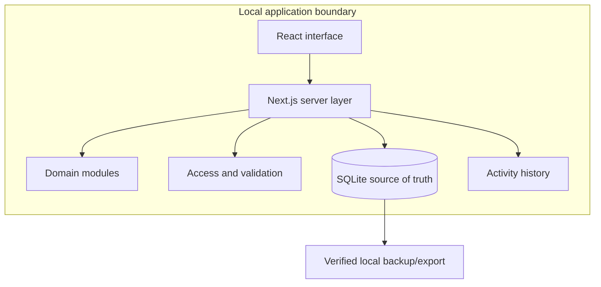

# CIE Architecture

## 1. Scope and System Purpose

CIE is a single-user, local-first application for structured operational and
decision records. This document describes only the public architectural shape;
private data models and operating configuration are excluded.

## 2. Current State vs Target Architecture

| Capability | Current state | Target state |
| --- | --- | --- |
| Application shape | Implemented structured monolith | Retain unless real scale requires change |
| Persistence | Implemented local relational store with migrations | Continue controlled schema evolution |
| Access | Implemented single-user application access | Improve within the same constrained operating model |
| Domain logic | Implemented as independently tested modules | Extend only through evidence from use |
| Activity history | Implemented for application-level changes | Complete release and operating review |
| Backup and export | Implemented software workflows | Complete remaining manual verification |
| Public or multi-user service | Not implemented | Not a current target |

## 3. High-Level Architecture

## 4. Core Components

| Component | Responsibility | Current status | Important concern |
| --- | --- | --- | --- |
| Web interface | Presents operational views and forms | Implemented | Must not become a second source of truth |
| Server layer | Owns reads, writes, and access checks | Implemented | Keep write behaviour consistent |
| Domain modules | Encapsulate scoring, review, and reference rules | Implemented | Remain independent and testable |
| Relational store | Persists structured application state | Implemented | Migrations must preserve existing data |
| Activity history | Records application-level change events | Implemented | History is useful but not an immutable external ledger |
| Backup/export | Produces controlled recoverable artifacts | Partially implemented operationally | Recovery requires manual verification as well as code |

## 5. Data Flow

1. The operator requests or edits a record through the web interface.
2. The server checks access and validates the operation.
3. Domain rules calculate or validate derived state where required.
4. The relational store is read or updated.
5. A relevant activity event is recorded for a successful change.
6. The interface is refreshed from server-owned state.

## 6. Storage and State

The relational database is the application source of truth. Interface state is
transient and derived from server reads. Migrations evolve persistent data, and
exports or backups provide separate recovery artifacts.

Private field definitions, record contents, and operational retention details
are intentionally not published.

## 7. External Integrations

The current application avoids runtime dependence on external business or AI
services. Development tooling may require ordinary package and container image
downloads, but application operation is designed to remain local.

## 8. Security and Trust Boundaries

- The application is intended for a constrained single-user environment.
- The server layer owns access checks and write validation.
- The browser is not treated as an authoritative data source.
- Export and backup operations are deliberate actions.
- Public hosting, multi-user isolation, and enterprise authentication are not
  claimed.

## 9. Failure Modes and Operational Concerns

| Concern | Current approach | Remaining concern |
| --- | --- | --- |
| Schema change | Versioned migrations and tests | Manual recovery still matters |
| Incomplete export | Completeness checks | New data types must join those checks |
| Invalid write | Server-side validation | Rules must remain consistent across interfaces |
| Lost local state | Backup and integrity workflows | Recovery must be practised |
| Documentation drift | Versioned plans and audits | Frequent development can still make summaries stale |

## 10. Key Architectural Decisions

- Use a structured monolith rather than distributed services.
- Keep persistent state local and relational.
- Route application writes through one server-side boundary.
- Keep domain calculations separate from interface components.
- Treat migrations, backups, and documentation as part of feature delivery.

## 11. Future Architecture

Near-term work completes the current operating and review gates. Hosted,
multi-user, or distributed architecture remains outside the public target until
real requirements justify the added complexity.
