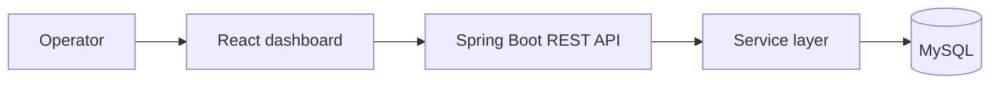

# CyberAudit OS

An experimental full-stack dashboard for modelling cybersecurity audit
operations.

| | |
| --- | --- |
| Status | Prototype |
| Implementation | Working local vertical slice with demo data; not a security assessment product |
| Repository | Not linked from this public portfolio |

## Overview

CyberAudit OS models the operational side of cybersecurity consulting: clients,
audits, findings, assets, and remediation status. The project was built to test
whether a conventional full-stack architecture could support a clear and useful
audit-operations interface.

It does not scan systems, assess real environments, or provide production
security guarantees.

## Problem

Audit work creates linked operational records that are difficult to understand
when spread across unrelated spreadsheets and reports. A dashboard can make
status and ownership easier to inspect, but only if the underlying relationships
and lifecycle states remain explicit.

This prototype explores that domain without claiming to replace professional
assessment tools or established audit methodology.

## Current Implementation

### Implemented

- responsive React dashboard with separate operational views;
- Spring Boot REST API using controller, service, repository, and DTO layers;
- relational models for clients, audits, findings, and assets;
- create, read, update, and delete operations for the core entities;
- dashboard metrics, filtering, status views, and drill-down navigation;
- seeded synthetic demonstration data;
- Docker Compose environment for the frontend, backend, and database;
- backend integration tests covering core API operations.

### Partially implemented

- forms support lightweight record management but not complete audit workflows;
- logging and validation provide a development baseline rather than production
  operations;
- the visual dashboard is more mature than the security and governance model.

### Not implemented

- authentication, authorization, or tenant isolation;
- vulnerability scanning or evidence collection;
- durable audit-event history;
- schema migration discipline for production data;
- report generation, file handling, notifications, or assignments;
- frontend automated tests or production deployment.

## Architecture

The prototype intentionally uses a conventional monolithic backend and separate
single-page frontend. It does not need microservices or distributed
infrastructure at its current scale.

See [architecture.md](./architecture.md) for the public architecture summary.

## Technology Stack

- React and TypeScript
- Vite and Tailwind CSS
- Java and Spring Boot
- Spring Data JPA
- MySQL
- Docker Compose
- JUnit and Spring integration testing

## Key Engineering Decisions

### Model the operational domain first

Clients, audits, findings, and assets are distinct but related concepts. Keeping
those relationships explicit supports useful navigation and metrics without
embedding domain state in the frontend.

### Use DTOs at the API boundary

The REST API returns purpose-built representations rather than serializing
persistence entities directly. This limits accidental coupling and recursive
entity graphs.

### Keep the architecture conventional

A React frontend, layered Spring Boot backend, and relational database provide
enough structure for the experiment. Additional infrastructure would not solve
the prototype's current product and security gaps.

### Use synthetic data only

The project has no controls for real client environments. Demonstration data is
therefore fictional and the public portfolio contains no operational records.

## Technical Challenges

- preserving readable entity relationships across API and interface layers;
- calculating useful dashboard views without moving business state into the
  client;
- supporting empty, loading, and failure states across multiple datasets;
- keeping an AI-assisted build understandable and maintainable after the
  initial implementation pass;
- separating visual polish from actual security readiness.

## Security and Privacy

The prototype has no authentication or tenant boundary and must not be used with
real audit or client data. It performs no security scanning. Local development
credentials and synthetic seed records are not production controls.

This case study intentionally avoids detailed operational schemas and does not
claim that the dashboard is suitable for professional engagements.

## Lessons Learned

- Security-oriented branding does not make a system secure.
- A polished dashboard can hide an immature domain and access model.
- Conventional layering makes experimental code easier to inspect and extend.
- Real audit operations would require evidence, history, ownership, and access
  controls before more visual features.
- AI-assisted implementation still requires an explicit architecture and
  adversarial review.

## Future Work

Future development depends on validating the problem with practitioners. If the
project continues, the next architectural work should address identity,
authorization, migrations, lifecycle history, and evidence handling before
additional dashboard scope.

## What This Project Demonstrates

CyberAudit OS demonstrates end-to-end product prototyping, React and Spring Boot
integration, relational domain modelling, REST API design, Dockerized local
development, and critical evaluation of an AI-assisted implementation.
