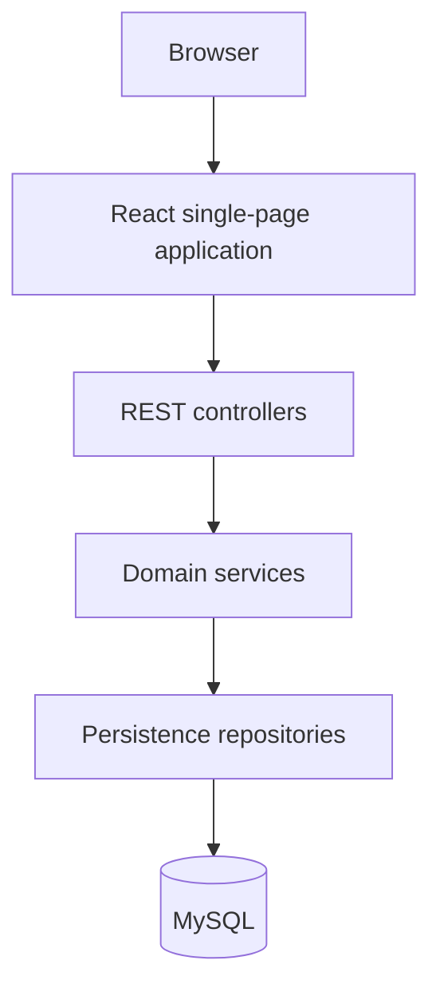

# CyberAudit OS Architecture

## 1. Scope and System Purpose

CyberAudit OS is a local demonstration of an operational dashboard for audit
records. It is not a vulnerability scanner, compliance engine, or production
security platform.

## 2. Current State vs Target Architecture

| Capability | Current state | Target state if validated |
| --- | --- | --- |
| Dashboard | Implemented prototype | Workflow-specific operational interface |
| REST API | Implemented CRUD foundation | Versioned and access-controlled API |
| Relational domain | Implemented core entities | Add lifecycle, evidence, and ownership concepts |
| Persistence | Local MySQL with automatic schema updates | Versioned migrations and recovery process |
| Authentication | Not implemented | Required before any real use |
| Tenant isolation | Not implemented | Required before multi-organisation use |
| Security assessment | Not implemented | Integrate only after product validation |
| Deployment | Local Docker Compose | Decide only after security and user requirements exist |

## 3. High-Level Architecture

## 4. Core Components

| Component | Responsibility | Current status | Important concern |
| --- | --- | --- | --- |
| Dashboard | Present metrics and entity views | Implemented | Must not become the source of domain truth |
| API client | Isolate frontend HTTP access | Implemented | Requires stronger runtime contract validation |
| Controllers | Expose CRUD operations | Implemented | No identity or permission checks exist |
| Services | Resolve relationships and basic rules | Implemented foundation | Domain behaviour remains thin |
| DTO layer | Define API request and response shapes | Implemented | Contracts are not formally versioned |
| Repositories | Persist core entities | Implemented | Production migration strategy is absent |
| Database | Store local demonstration state | Implemented | Synthetic data only |

## 5. Data Flow

1. The dashboard requests entity collections from the API.
2. Controllers delegate data access and basic validation to services.
3. Services resolve relationships through repositories.
4. DTOs are returned to the frontend.
5. Dashboard views derive metrics and filtered lists from the API data.
6. Lightweight forms send create or update requests through the same layers.

## 6. Storage and State

MySQL stores client, audit, finding, and asset demonstration records. The
database is the source of truth; frontend state is derived from API responses.
The current automatic schema-management approach is suitable only for the
prototype and is not presented as a production migration strategy.

## 7. External Integrations

No vulnerability scanners, identity providers, evidence stores, notification
systems, or production security services are currently integrated.

## 8. Security and Trust Boundaries

- The browser and API operate without user authentication.
- No tenant or organisation boundary is enforced.
- The system must contain synthetic demonstration data only.
- API DTOs reduce persistence coupling but do not provide authorization.
- Real assessment operations remain outside the system's current trust model.

## 9. Failure Modes and Operational Concerns

| Concern | Current approach | Remaining concern |
| --- | --- | --- |
| Invalid input | Basic backend validation | Domain rules remain limited |
| Missing relationship | Service-level lookup and errors | Error contracts need formalisation |
| Database change | Automatic development updates | Versioned migrations are required |
| API unavailable | Frontend error states | No production supervision or recovery |
| Unauthorized access | Local demonstration assumption | Authentication and authorization are mandatory before real use |
| Record deletion | Simple CRUD semantics | Real audits require archival and history decisions |

## 10. Key Architectural Decisions

- Use a conventional layered monolith.
- Separate persistence entities from API DTOs.
- Keep frontend API access in one service boundary.
- Prefer synthetic seed data to premature real-world integration.
- Defer distributed architecture until product evidence requires it.

## 11. Future Architecture

Further architecture should follow user validation. Identity, authorization,
migrations, lifecycle history, and evidence handling take priority over
microservices, automated scanning, or additional visual complexity.
