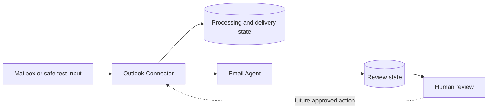

# Human-Reviewed Email Workflow

A modular email-processing workflow that prepares incoming communication for
assisted analysis and deliberate human review.

| | |
| --- | --- |
| Status | Prototype |
| Implementation | Working local workflow with integration foundations; production mailbox operation and controlled outbound actions remain incomplete |
| Repository | Not linked from this public portfolio |

## Overview

The project explores how email assistance can reduce repetitive preparation
work without giving an automated reasoning component unrestricted mailbox
control or authority to communicate externally.

It is composed of three public-facing responsibilities:

- **Outlook Connector:** mailbox-facing transport, normalization, and delivery
  state;
- **Email Agent:** structured analysis and response preparation;
- **Review Interface:** human inspection, editing, approval, rejection, and
  escalation.

Detailed workflow rules, private prompts, message contracts, and business
context are intentionally excluded.

## Problem

Operational inboxes contain inconsistent, ambiguous, and sometimes sensitive
requests. Directly connecting an AI component to a mailbox creates unnecessary
access and control risks. Fully autonomous responses also remove the judgement
needed for uncertain or high-impact communication.

The system therefore separates transport, assisted reasoning, and human
authority.

## Current Implementation

### Implemented

- controlled local and integration-oriented message ingestion;
- normalization into an internal message representation;
- persistent processing and delivery state;
- duplicate protection across repeated ingestion;
- separation between mailbox access and assisted processing;
- delivery from the connector to the Email Agent;
- structured analysis with deterministic safety checks;
- persistent review queue and editable review interface;
- mandatory human review in the result model;
- synthetic test inputs and automated tests.

### Partially implemented

- Microsoft 365 integration is scaffolded and supports bounded retrieval
  operations, but is not presented as a production synchronization service;
- model-assisted drafting exists behind a replaceable provider boundary, but
  production provider selection and evaluation remain open;
- failure state is persisted, while full retry scheduling and operator recovery
  remain incomplete.

### Planned or blocked

- continuous mailbox synchronization;
- approved production permissions and mailbox scoping;
- broader attachment handling;
- authenticated multi-user review;
- business-context retrieval through narrowly defined capabilities;
- a durable, duplicate-safe outbound approval and send flow;
- production monitoring, retention, backup, and recovery.

## Architecture

The connector is the mailbox-access boundary. The Email Agent receives only the
information needed for processing. No external communication should occur
without deliberate human approval.

See [architecture.md](./architecture.md) for the public architecture summary.

## Technology Stack

- Python
- Microsoft Graph integration foundations
- FastAPI
- SQLite
- HTML templates for the local review interface
- Pytest

## Key Engineering Decisions

### Separate transport from reasoning

The connector owns mailbox-facing behavior and source identity. The Email Agent
owns interpretation and response preparation. This limits credential exposure
and lets either side evolve without absorbing the other's responsibilities.

### Persist workflow state

Email processing is not a stateless request-response problem. The workflow must
remember what it has seen, what was delivered, and what still requires review.

### Keep human approval structural

Human review is represented in contracts and state rather than left as an
informal operating instruction. Assisted output remains a proposal.

### Retain deterministic test paths

Synthetic inputs and deterministic providers allow the workflow to be tested
without requiring private messages or live external services.

## Technical Challenges

- preserving stable message identity across repeated processing;
- recovering safely when delivery succeeds only partially;
- distinguishing transport failures from reasoning or review failures;
- handling uncertain content without over-automating decisions;
- keeping private mailbox data out of tests, logs, and public documentation.

## Security and Privacy

- Mailbox credentials belong only to the connector boundary.
- Assisted processing does not receive unrestricted mailbox access.
- Real messages, identifiers, configuration, and generated outputs are excluded
  from this portfolio.
- External communication requires human approval.
- Detailed permissions, routing policies, prompts, and business rules are not
  publicly documented.

These boundaries reduce exposure, but the prototype is not described as a
completed production system.

## Lessons Learned

- Reliable ingestion and state management matter as much as model output.
- Human review must be visible in the architecture and data model.
- A useful draft requires grounded context, not only email classification.
- Safe local adapters make development possible without normalising the use of
  private production data.
- Integration ownership is easier to reason about when transport and assisted
  processing remain separate.

## Future Work

- prove controlled mailbox synchronization in the intended environment;
- strengthen delivery recovery and bounded retry handling;
- add narrow, read-only context capabilities where justified;
- formalize the approved outbound action lifecycle;
- complete production access, monitoring, and recovery controls.

## What This Project Demonstrates

This project demonstrates integration-boundary design, stateful workflow
engineering, duplicate protection, replaceable processing components,
human-in-the-loop control, and privacy-conscious testing.
