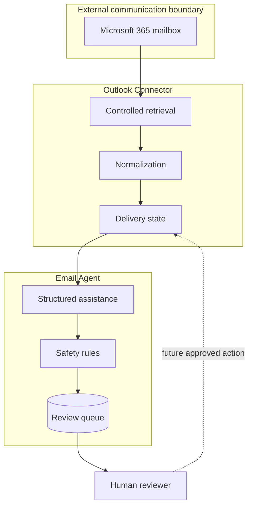

# Email Workflow Architecture

## 1. Scope and System Purpose

The workflow prepares selected email for assisted processing and human review.
It does not grant the processing component direct mailbox authority, and it does
not treat generated text as an approved external action.

This document intentionally omits private message contracts, routing logic,
business rules, and environment configuration.

## 2. Current State vs Target Architecture

| Capability | Current state | Target state |
| --- | --- | --- |
| Safe development input | Implemented with synthetic and local adapters | Retain for deterministic testing |
| Mailbox access | Bounded integration foundations implemented | Controlled continuous synchronization |
| Normalization | Implemented | Evolve only through versioned changes |
| Duplicate protection | Implemented for the current workflow | Preserve across synchronization and outbound actions |
| Connector-to-agent delivery | Implemented locally | Add bounded retries and operator recovery |
| Assisted processing | Implemented behind a provider boundary | Ground outputs in approved context |
| Human review | Implemented as persistent local workflow | Add authenticated reviewer identity and stronger history |
| External sending | Not implemented as a production workflow | Deliberate, duplicate-safe approved action |

## 3. High-Level Architecture

## 4. Core Components

| Component | Responsibility | Current status | Important concern |
| --- | --- | --- | --- |
| Outlook Connector | Own mailbox access, normalization, identity, and delivery state | Partially implemented | Must not absorb reasoning logic |
| Connector state | Track processed and pending work | Implemented | Partial failure must remain recoverable |
| Email Agent | Produce structured assistance from normalized input | Prototype | Output is probabilistic and advisory |
| Safety rules | Escalate or restrict unsuitable assistance | Implemented foundation | Rules require continued evaluation |
| Review state | Preserve generated output and reviewer changes | Implemented locally | Concurrent and multi-user use is not complete |
| Human reviewer | Edit, reject, approve, or escalate | Implemented local workflow | Approval must remain deliberate |
| Outbound action | Apply an approved external change | Architecture target | Requires identity, idempotency, and recovery |

## 5. Data Flow

1. The connector retrieves a selected message or accepts a safe test input.
2. Source data is normalized and assigned durable workflow identity.
3. Existing state is checked to prevent repeated processing.
4. A pending delivery is persisted and passed to the Email Agent.
5. The Email Agent creates structured assistance subject to safety rules.
6. The result is stored in the review queue.
7. A human edits, rejects, approves, or escalates the proposal.
8. External action remains a separately controlled target capability.

## 6. Storage and State

The mailbox remains the source of truth for email. Local stores hold workflow
identity, processing state, delivery state, and review state. Private message
content and retention choices are not documented here.

Durable state supports duplicate protection and recovery, but full production
retry and backup operations remain incomplete.

## 7. External Integrations

- Microsoft 365 through the connector boundary;
- a replaceable assistance provider behind the Email Agent;
- future narrowly scoped business-context capabilities.

No provider configuration or private integration detail is published.

## 8. Security and Trust Boundaries

- The connector alone owns mailbox credentials.
- The Email Agent receives normalized input, not mailbox authority.
- Assisted output is advisory.
- Human review is required before external communication.
- Test fixtures use synthetic content.
- Live permissions and outbound actions are disabled or incomplete until their
  control and recovery paths are validated.

## 9. Failure Modes and Operational Concerns

| Concern | Current approach | Remaining concern |
| --- | --- | --- |
| Duplicate ingestion | Persistent source identity | Identity must remain stable through future mailbox actions |
| Agent unavailable | Pending delivery state | Bounded scheduling and dead-letter handling remain future work |
| Invalid assistance | Structured validation and safety rules | Evaluation against realistic cases must continue |
| Reviewer mistake | Deliberate editable review | Stronger reviewer identity and history are planned |
| Ambiguous external result | External action not yet enabled | Future send flow needs idempotent receipts and recovery |
| Sensitive test data | Synthetic fixtures | Operational logging and retention require continued review |

## 10. Key Architectural Decisions

- Separate mailbox transport from assisted reasoning.
- Normalize source input before downstream processing.
- Persist processing and review state.
- Make human approval part of the system model.
- Keep providers replaceable and deterministic test paths permanent.
- Treat external actions as a distinct future contract and state machine.

## 11. Future Architecture

The target adds controlled synchronization, grounded context retrieval,
authenticated review, and a recoverable approved-action flow. It does not
remove human authority or grant the Email Agent direct mailbox access.
