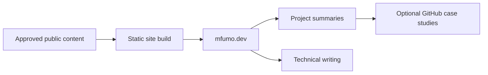

# Mfumo

A public platform direction for presenting selected projects, experiments, and
technical writing as one coherent body of work.

| | |
| --- | --- |
| Status | Architecture target |
| Implementation | Public information architecture and content direction are defined; the public platform is not presented here as complete |
| Repository | Not linked from this public portfolio |

## Overview

Mfumo is being restructured as the public home for selected work and writing.
Its role is broader than a portfolio index: it should connect projects with the
experiments, decisions, and lessons that produced them.

This case study covers only the intended public experience. Private working
systems, local workflows, and internal data organisation are intentionally out
of scope.

## Problem

A list of repositories shows artifacts but rarely explains continuity: why a
project exists, what stage it has reached, what was learned, and how it relates
to later work. At the same time, an elaborate portfolio can become another
product that consumes more time than the work it is meant to communicate.

Mfumo's public direction therefore prioritizes a small, maintainable publishing
surface with honest status labels and durable project pages.

## Current Implementation

### Implemented

- a defined public content model for projects and writing;
- an approved project-status vocabulary;
- information architecture for the public site;
- design and content principles focused on restraint and accessibility;
- a publication plan with explicit launch and ownership requirements.

### Architecture target

- a static public site generated from approved public content;
- project pages that link concise narrative with deeper technical case studies;
- technical writing and experiment records;
- accessible, low-JavaScript pages with predictable metadata and URLs;
- a release process that publishes only reviewed public material.

### Not claimed

- a currently complete or launched public platform;
- automatic publication from private project repositories;
- public access to internal working systems;
- real-time synchronization with private data.

## Public Architecture Direction

The public build should consume only deliberately approved public content. It
must not query private repositories or private working systems.

See [architecture.md](./architecture.md) for the public architecture summary.

## Technology Direction

- static site generation;
- structured Markdown content;
- schema validation for public metadata;
- minimal client-side JavaScript;
- privacy-conscious hosting and analytics decisions.

Technologies remain architecture choices until the public site is implemented
and verified.

## Key Engineering Decisions

### Separate discovery from technical depth

Mfumo should provide concise project narratives. This repository provides the
optional deeper architecture layer. Readers can stop at the level appropriate
to them.

### Publish from an explicit public boundary

Only approved public metadata should enter the site build. Private repositories
must not become implicit content sources.

### Prefer static delivery

A project and writing site does not require an application backend by default.
Static generation reduces runtime complexity, cost, and attack surface.

### Make status part of the content model

Projects should be labelled honestly as active, prototype, planned, or archived
rather than editorialized into a uniform success story.

## Technical Challenges

- keeping public summaries synchronized without exposing private sources;
- distinguishing useful technical depth from unnecessary disclosure;
- preventing portfolio maintenance from competing with project development;
- launching with enough real content instead of overbuilding the platform;
- preserving stable links while projects continue to change.

## Security and Privacy

Mfumo's public surface should contain only material already approved for public
release. It should not reveal private repository locations, local systems,
internal workflows, unpublished records, or detailed operating architecture.

Automation may prepare changes, but publication requires manual review.

## Lessons Learned

- A public portfolio and an architecture repository can serve different reading
  depths without duplicating each other.
- Content boundaries are a security decision, not only an editorial choice.
- Static delivery is a useful default when the product is information.
- Honest project status is more credible than presenting every experiment as a
  finished product.
- A portfolio should support the work rather than become the work.

## Future Work

- implement and verify the public site;
- establish the approved metadata handoff from this showcase;
- publish a small initial set of project pages and writing;
- add scheduled stale-content reports without automatic publication.

## What This Project Demonstrates

Mfumo demonstrates information architecture, product restraint, public/private
content boundaries, static publishing strategy, and the design of a sustainable
technical communication system.
