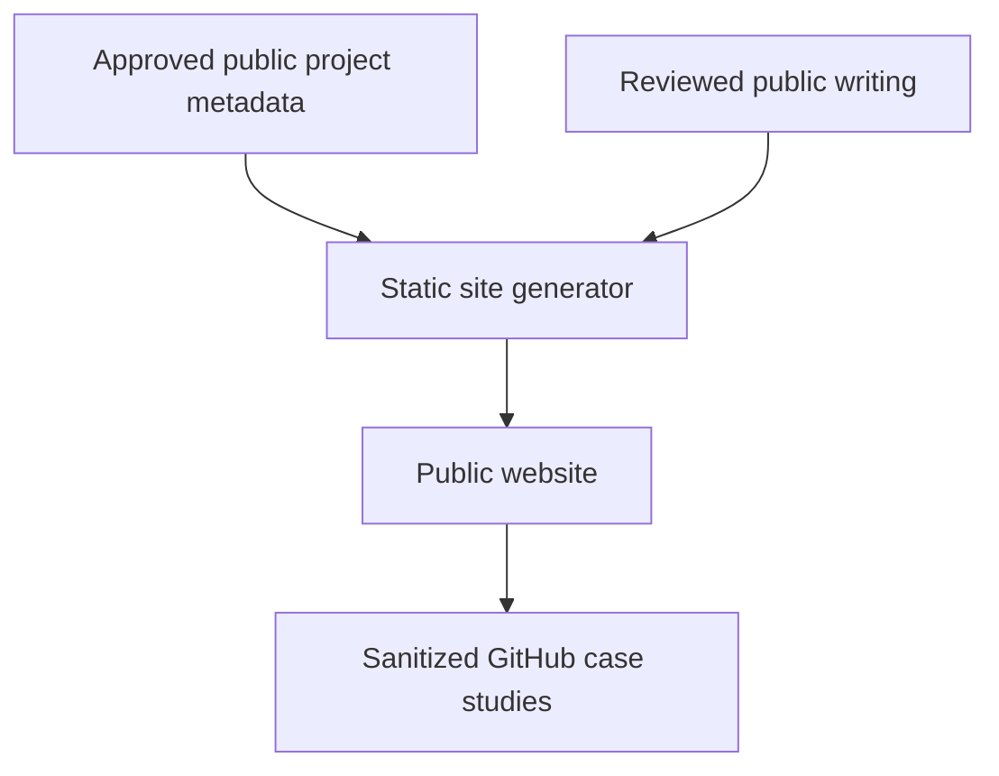

# Mfumo Public Architecture

## 1. Scope and System Purpose

This document describes the intended public website only. Private tools,
internal data, and local working architecture are outside its scope.

## 2. Current State vs Target Architecture

| Capability | Current state | Target state |
| --- | --- | --- |
| Public information architecture | Defined | Validate through implementation |
| Public project metadata | Defined in concept and in this showcase | Shared, reviewed public source |
| Public site | Not claimed as complete | Static generated website |
| Project pages | Content direction defined | Concise summaries with optional case-study links |
| Writing | Publishing structure defined | Small curated collection |
| Private-source synchronization | Intentionally absent | Scheduled review reports only |
| Publication approval | Manual policy established | Keep as mandatory release gate |

## 3. High-Level Architecture

## 4. Core Components

| Component | Responsibility | Current status | Important concern |
| --- | --- | --- | --- |
| Public manifest | Store approved names, summaries, and statuses | Implemented in this showcase | Must contain no private-source metadata |
| Public content | Hold intentionally published project and writing content | Partially defined | Editorial review remains necessary |
| Static build | Generate stable public pages | Architecture target | Build must not access private repositories |
| Public website | Provide discovery and concise narrative | Architecture target | Keep maintenance and runtime complexity low |
| Case-study links | Offer optional technical depth | Implemented as this repository | Avoid duplicating full case studies on the site |
| Review process | Prevent accidental publication | Policy implemented | Must remain manual at the final gate |

## 5. Data Flow

1. A project changes in its private source repository.
2. An on-demand or scheduled audit identifies potentially stale public content.
3. A minimal update is drafted against the public manifest or case study.
4. Accuracy and disclosure checks are performed.
5. A human approves the change.
6. The approved public metadata is included in a static site build.

Private implementation content never becomes a direct build input.

## 6. Storage and State

The public website needs only version-controlled public content and generated
static output. Private project state and operational records remain in their own
systems and are neither copied nor queried at build time.

## 7. External Integrations

The target requires ordinary static hosting and may link to selected public
GitHub case studies. Analytics, feeds, and other services should be added only
when their purpose and privacy impact are clear.

## 8. Security and Trust Boundaries

- Only approved public content enters the build.
- Private repositories are outside the build trust boundary.
- Generated updates cannot bypass human review.
- Public status information is intentionally minimal.
- Internal tools and local topology are not documented.

## 9. Failure Modes and Operational Concerns

| Concern | Mitigation |
| --- | --- |
| Private detail copied into public content | Allowlisted manifest plus manual diff review |
| Stale project status | Scheduled report and `last_reviewed` metadata |
| Site and showcase disagree | Treat the public manifest as the shared approved index |
| Build depends on a private system | Prohibit private repositories as build inputs |
| Portfolio consumes excessive maintenance time | Keep pages static, concise, and generated from small content files |

## 10. Key Architectural Decisions

- Use an explicit public-content boundary.
- Prefer static generation over a runtime application.
- Keep public discovery separate from deeper technical evidence.
- Share only approved metadata between public surfaces.
- Automate stale-content detection, not publication.

## 11. Future Architecture

Implementation should begin with a small static site and a handful of reviewed
pages. Search, analytics, interactive features, or further automation should be
added only when demonstrated public needs justify them.
