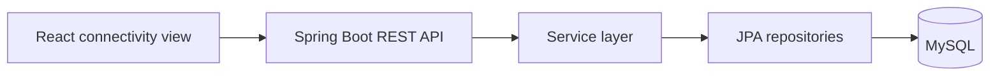

# WMA

A personal full-stack learning project for structured financial record
management.

| | |
| --- | --- |
| Status | Maintained intermittently |
| Implementation | Early backend foundation and frontend connectivity check |
| Repository | Not linked from this public portfolio |

## Overview

WMA is a long-running project used to practise full-stack development directly
with Java, Spring Boot, React, relational data modelling, and Docker. It is
developed intermittently alongside other work.

The project is intentionally documented according to its current implementation
rather than its larger product ambition. Personal records and intended private
use are outside this public case study.

## Problem

Financial records contain relationships between people, transaction types, and
ownership information that become difficult to maintain in unstructured files.
WMA explores how those records can be represented through a relational backend
and a stable API boundary.

## Current Implementation

### Implemented

- Spring Boot backend;
- user and transaction entities with a relational association;
- read-only REST endpoints for users and transactions;
- controller, service, repository, entity, and DTO layers;
- DTO-based API responses rather than direct entity serialization;
- MySQL development database through Docker Compose;
- local frontend-to-backend connectivity;
- development-only synthetic seed data;
- a basic application-context test.

### Partially implemented

- the React frontend currently confirms connectivity but does not provide a
  functional dashboard;
- the domain model establishes users, roles, ownership percentages, and
  transactions without implementing a complete financial workflow;
- test coverage is limited to application startup.

### Planned

- write endpoints and request validation;
- richer asset and investment models;
- authentication and authorization;
- database migrations;
- meaningful backend and frontend tests;
- reporting, dashboards, and deployment automation.

## Architecture

See [architecture.md](./architecture.md) for the public architecture summary.

## Technology Stack

- Java and Spring Boot
- Spring Data JPA and Hibernate
- React and TypeScript
- MySQL
- Docker Compose
- Maven and Vite

## Key Engineering Decisions

### Start with a layered monolith

Controller, service, repository, DTO, and entity layers make responsibilities
visible without requiring distributed services.

### Use a relational model

Transactions and ownership-related records have explicit relationships. A
relational database provides a clearer foundation than disconnected frontend
state or flat documents.

### Introduce DTOs early

DTO responses resolved recursive serialization and prevent the public API from
being defined accidentally by persistence entities.

### Containerize the database

Docker Compose provides a repeatable local database without containerizing the
entire application before that complexity is needed.

## Technical Challenges

- understanding entity relationships and serialization behaviour;
- separating API contracts from persistence structures;
- handling Docker volume state and environment configuration;
- connecting frontend and backend development servers safely;
- maintaining momentum on a learning project without overstating progress.

## Security and Privacy

The current application has no authentication or authorization and is not
suitable for real financial records. Development configuration, synthetic
records, and DTO boundaries are useful foundations but are not a security
system.

This public case study contains no personal identities, financial values, or
private intended-use details.

## Lessons Learned

- Persistence entities are poor default API contracts.
- A small layered monolith is enough to practise meaningful backend boundaries.
- Docker volumes preserve state independently of container recreation.
- Authentication and input validation must be implemented before real data is
  considered.
- A project's public status should reflect its actual development cadence.

## Future Work

WMA remains an intermittent learning project. The next useful slice is a tested
write workflow with validation and database migrations, followed by a small
frontend view that uses it. Larger product features should wait until that
foundation is complete.

## What This Project Demonstrates

WMA demonstrates direct full-stack learning through Spring Boot architecture,
REST API design, DTO boundaries, relational modelling, Dockerized database
development, and honest incremental scope.
