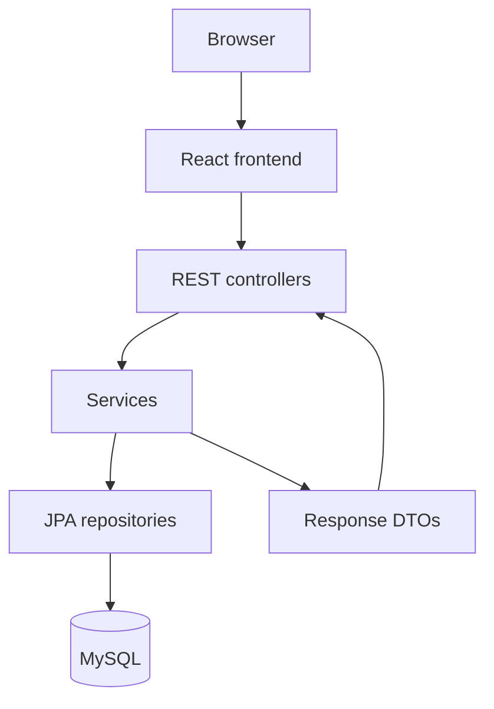

# WMA Architecture

## 1. Scope and System Purpose

WMA is an early-stage full-stack learning application for structured financial
records. The current implementation is a small read-oriented backend foundation,
not a complete financial platform.

## 2. Current State vs Target Architecture

| Capability | Current state | Target state |
| --- | --- | --- |
| Frontend | Connectivity view only | Focused record-management interface |
| REST API | Read endpoints for users and transactions | Validated read and write workflows |
| Domain model | Users, roles, transactions, transaction types | Extend only after core workflows are tested |
| API boundary | Response DTOs implemented | Add request DTOs and validation |
| Persistence | JPA with local MySQL | Versioned migrations and recovery guidance |
| Authentication | Not implemented | Required before real records |
| Authorization | Roles stored but not enforced | Explicit role-based rules after authentication |
| Testing | Context startup test | Service, repository, API, and frontend tests |
| Deployment | Database container only | Decide after the application is functionally complete |

## 3. High-Level Architecture

## 4. Core Components

| Component | Responsibility | Current status | Important concern |
| --- | --- | --- | --- |
| React frontend | Verify and later present API data | Minimal | No functional record views yet |
| Controllers | Expose user and transaction reads | Implemented | No write endpoints or access checks |
| Services | Map persisted records to DTOs | Implemented foundation | Business rules remain minimal |
| DTOs | Define public response shapes | Implemented | Request contracts are not present |
| Repositories | Provide JPA persistence access | Implemented | Query and transaction needs remain simple |
| Entities | Model users and transactions | Implemented foundation | Broader domain is planned only |
| MySQL | Store local development state | Implemented through Docker | Migrations and backup are absent |

## 5. Data Flow

### Current read flow

1. The frontend or API client requests users or transactions.
2. A controller calls the corresponding service.
3. The service reads entities through a repository.
4. Entities are converted to response DTOs.
5. JSON responses are returned to the caller.

### Target write flow

A future write flow will introduce request DTOs, input validation, explicit
business rules, persistence transactions, and authorization. It is not part of
the current implementation.

## 6. Storage and State

MySQL stores development users and transactions. Synthetic seed data is created
for local development. The database is authoritative for implemented records;
the frontend currently holds only transient connection state.

Assets, investments, audit history, and account balances are not current stored
capabilities.

## 7. External Integrations

The only material external dependency is the local MySQL database managed with
Docker Compose. Cloud hosting, identity providers, monitoring services, and
financial APIs are not integrated.

## 8. Security and Trust Boundaries

- The frontend does not access the database directly.
- DTOs limit accidental persistence-model exposure.
- Development configuration is separated from source through environment
  variables.
- Authentication, authorization, write validation, and audit logging are not
  implemented.
- Real personal or financial data must not be used in the current system.

## 9. Failure Modes and Operational Concerns

| Concern | Current approach | Remaining concern |
| --- | --- | --- |
| Recursive serialization | DTO response models | Expand DTO discipline to requests |
| Database unavailable | Application startup failure | Add useful error handling and diagnostics |
| Invalid input | No write path yet | Validation is required before writes |
| Unauthorized access | Local development assumption | Authentication and authorization are required |
| Schema drift | Automatic ORM behaviour | Add versioned migrations |
| Data loss | Persistent Docker volume | Backup and recovery remain undefined |

## 10. Key Architectural Decisions

- Use a layered Spring Boot monolith.
- Keep the database behind the backend API.
- Use DTOs instead of returning persistence entities.
- Use MySQL for relational development state.
- Containerize infrastructure incrementally.

## 11. Future Architecture

The next architecture step is not a larger platform. It is a narrow, tested
write workflow with validation and migrations, followed by a frontend that uses
that workflow. Authentication must precede any use of real records.
